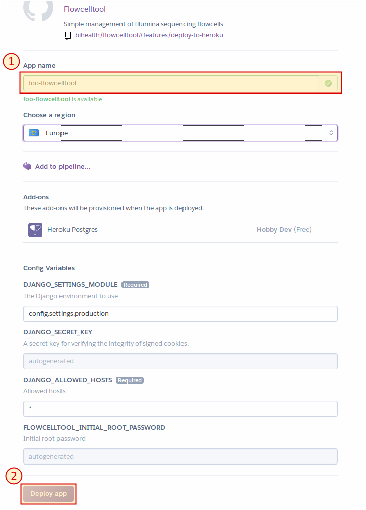

.. _install_on_heroku:

=================
Install on Heroku
=================

Heroku is a platform as a service (PAAS) provider.
Flowcelltool can be installed into their free plan option with a few clicks.
This is the easiest installation option and for trying out Flowceltool with minimal effort.

-------------
Prerequisites
-------------

Create a (free) account on `Heroku <https://www.heroku.com>`_ and log into the account.

------------
Installation
------------

Click on the following button to start the installation.

.. image:: images/button.svg
    :align: center
    :alt: Deploy to Heroku
    :target: https://heroku.com/deploy?template=https://github.com/bihealth/flowcelltool/tree/features/deploy-to-heroku

You will be directed to the Heroku website.

Fill in the name for your Flowcelltool installation and click on the "Deploy App" button.

Wait until the installation is complete.

An administration user ``root`` will be automatically created with a random password.
You can lookup the automatically generated password now.

- Click "Manage App" button displayed after successful installation in a new tab.
- Go to "Settings"
- Click "Reveal Config Vars"
- The password for the ``root`` user is stored in the ``FLOWCELLTOOL_INITIAL_ROOT_PASSWORD`` config variable.
- Copy that password into the clipboard.
- Click on the "Open app" button on the top.
- Log in with user ``root`` and the password from the clipboard.

--------------------
Continuing From Here
--------------------

Now, continue with the :ref:`getting_started` guide or read on Email sending and LDAP authentication in :ref:`install_advanced`.
